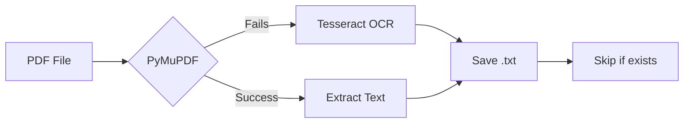

# doc2text

A parallel PDF to text converter that automatically extracts text from PDFs using a smart dual-approach system.


## Features

- **Fast text extraction** using PyMuPDF for text-based PDFs
- **OCR fallback** with Tesseract for scanned/image-based PDFs
- **Multi-threaded processing** utilizing all available CPU cores
- **Smart preprocessing** with adaptive thresholding for better OCR accuracy
- **Automatic skipping** of already-processed files
- **Cross-platform GUI** and CLI support

## Installation

```bash
# Install Python dependencies
pip install fitz pytesseract pdf2image opencv-python numpy
```

**Prerequisites:** Install [Tesseract OCR](https://tesseract-ocr.org) on your system:

- **Ubuntu/Debian**: `sudo apt-get install tesseract-ocr`
- **macOS**: `brew install tesseract`
- **Windows**: Download from [tesseract-ocr.org](https://tesseract-ocr.org)

## Quick Start

### Command Line

1. Place PDF files in `INPUT_DIR/`
2. Run the converter:
   ```bash
   python pdf_to_text_parallel.py
   ```
3. Extracted text files appear in `OUTPUT_DIR/`

### GUI

```bash
python gui_runner.py
```

Click "Start Processing" to begin. Output appears in the text area.

## How It Works



1. **PyMuPDF**: Attempts fast text extraction first
2. **Fallback**: If content is empty/short (<200 chars), switches to OCR
3. **Preprocessing**: Converts images → grayscale → adaptive thresholding
4. **OCR**: Tesseract extracts text from preprocessed images
5. **Output**: Saves to `{filename}.txt` in `OUTPUT_DIR`

## Project Structure

```
doc2text/
├── INPUT_DIR/          # Place PDFs here
├── OUTPUT_DIR/         # Extracted text files appear here
├── pdf_to_text_parallel.py  # Main parallel converter
├── gui_runner.py       # Graphical interface
├── LICENSE             # MIT License
└── README.md
```

## Usage Tips

- The converter automatically skips PDFs with extracted text files
- Large PDFs are processed faster with multi-threading
- OCR mode activates automatically for image-heavy PDFs

## License

MIT License
